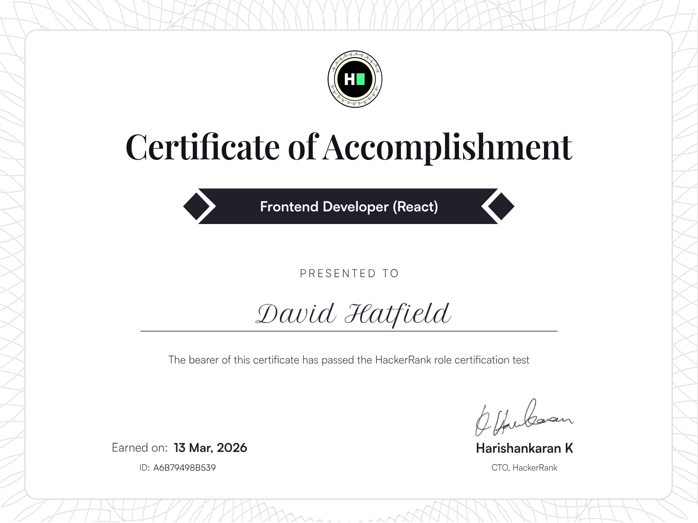

# 👋 Hello, I'm David

**Senior Software Engineer | Python, React, Node.js, AI Agent, SaaS**  
You don't just need a developer — you need someone who understands how to ship AI-powered products that scale.

I'm a **Senior Full Stack Engineer** with deep expertise in building modern SaaS applications from the ground up. My sweet spot is where intelligent systems meet great user experience — architecting backends that power **LLM and AI agent workflows**, designing clean **React frontends**, and wiring everything together with robust APIs that perform under pressure.

Over the course of my career, I've worked across the full product lifecycle — from initial architecture through production deployment. I've built AI-integrated platforms leveraging **OpenAI, LangChain, and AI agent frameworks**; developed scalable **REST APIs with FastAPI and Django**; delivered responsive **Next.js frontends**; and deployed production infrastructure on **AWS with Docker and DevOps best practices**.

I work well with early-stage startups who need a technical co-pilot as much as a coder, and with established teams who need a senior engineer who can hit the ground running without hand-holding.

## 💼 What I Do Best

- **AI Agent development** — my strongest area; I build robust agent systems with tool-calling, memory, orchestration, and automation for real business use cases
- **AI SaaS product development** — LLM pipelines, RAG systems, and intelligent workflows that power scalable software products
- **Full stack engineering** with Python (FastAPI / Django), React / Next.js, and Node.js
- **Backend architecture** with Supabase, PostgreSQL, and RESTful API design
- **AWS cloud infrastructure** with Docker and CI/CD pipelines
- **End-to-end product delivery** from architecture to production deployment

## 🧰 Tech Stack

- **Backend:** Python, FastAPI, Django, Node.js, REST APIs, scalable backend systems
- **Frontend:** React, Next.js, responsive product interfaces, modern SaaS UI
- **Database:** PostgreSQL, Supabase, relational data modeling, API-driven systems
- **AI & Automation:** OpenAI, LangChain, RAG pipelines, AI agents, workflow automation
- **Cloud & DevOps:** AWS, Docker, CI/CD, production deployment, scalable infrastructure

My focus is always on **clean architecture, scalability, and long-term maintainability**. I help teams build products that not only launch fast, but also stay reliable as usage grows.

If you're building an AI-powered SaaS product, internal platform, or modern web application, I can help architect and develop a system that is production-ready and built for long-term growth.

## 🏆 Certifications

  
  

## 🚀 Selected Projects

Below are some of the most representative repositories from my profile. They highlight my experience building **AI-powered SaaS products, agent-driven workflows, and full-stack platforms** using Python, React/Next.js, Node.js, and modern cloud-ready architecture.

| Repository | Description | Stack |
|------------|-------------|-------|
| [Cortextflow AI](https://github.com/dhatfieldai/cortextflowai) | Full-stack agentic chat platform with streaming UI, memory, tool-calling, and persistent conversations for AI-driven workflows | Next.js, React, Python, AI Agents |
| [Revenuepilot AI](https://github.com/dhatfieldai/revenuepilot-ai) | AI-powered revenue operations platform with forecasting, RAG pipelines, approval workflows, and full-stack SaaS architecture | FastAPI, Next.js, React, PostgreSQL, AI |
| [Agentroom](https://github.com/dhatfieldai/agentroom) | SaaS platform for AI-powered virtual agents and video-based interactions with transcription, summarization, and subscription flows | Next.js, React, TypeScript, AI, SaaS |
| [Mini-SRE-Agent](https://github.com/dhatfieldai/mini-sre-agent) | AI automation agent that scans repositories, analyzes issues, and opens pull requests with suggested fixes through an orchestrated workflow | Python, FastAPI, Node.js, AI Agents |
| [Preptalk AI](https://github.com/dhatfieldai/preptalk-ai) | Voice-based AI interview practice application that simulates mock interviews and generates structured feedback using LLM workflows | Next.js, React, OpenAI, VAPI, Firebase |
| [CreatorIQ](https://github.com/dhatfieldai/creatoriq) | AI content workflow platform that transforms videos into transcripts, titles, thumbnails, and actionable content insights | Next.js, TypeScript, OpenAI, Convex, SaaS |

*(Explore more repositories on my GitHub profile.)*

Thanks for visiting! ⭐
